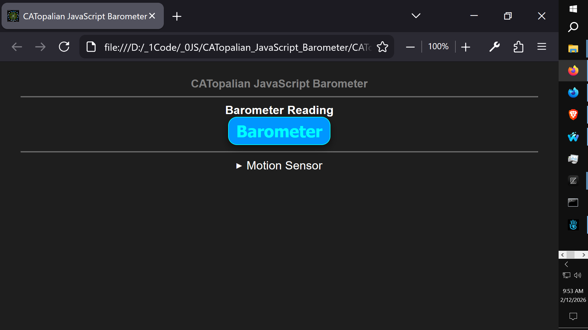

# CATopalian JavaScript Barometer Sensor
A JavaScript application that gets lon/lat, address, and barometer reading from your location

---

Use App: https://christopherandrewtopalian.github.io/CATopalian_JavaScript_Barometer_Sensor/CATopalian_JavaScript_Barometer_Sensor.html

---

### How to Download this App
1. Click the green Code Button on this github page
2. Choose Download ZIP
3. Save the Zip File
4. Extract All
5. Double click the HTML file to start the App. note: motion sensor only works on cell phones or tablets that have the motion sensor.

---

Happy Scripting :-)

---

// Dedicated to God the Father  
// All Rights Reserved Christopher Andrew Topalian Copyright 2000-2026  
// https://github.com/ChristopherTopalian  
// https://github.com/ChristopherAndrewTopalian  
// https://sites.google.com/view/CollegeOfScripting

